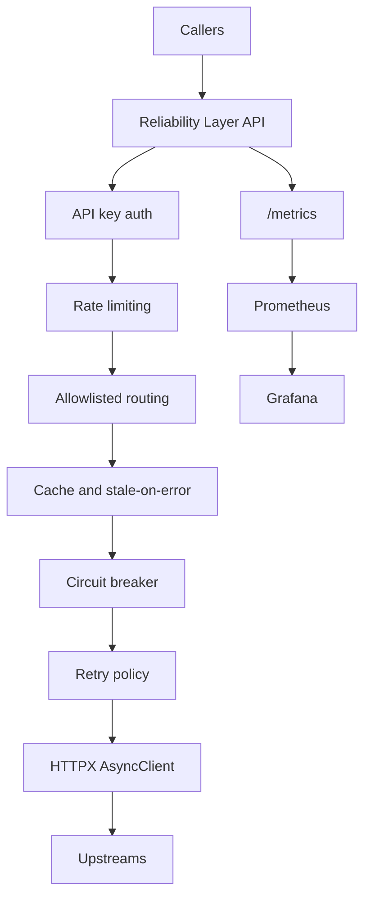

# Reliability Layer API

A FastAPI-based reliability gateway that sits between internal callers and upstream HTTP
dependencies. It centralizes strict timeouts, bounded retries with jitter, circuit breaking,
cache-plus-stale fallback, rate limiting, health checks, structured logs, and Prometheus
metrics.

## Why It Exists
- Prevent ad hoc timeout and retry logic from being reimplemented inconsistently across services.
- Cap failure amplification during partial outages such as timeouts, intermittent 5xx responses,
  and upstream throttling.
- Give platform and SRE workflows one place to observe dependency health and gateway behavior.

## Architecture



## Behavior Contract
- Only configured upstreams are reachable through `/proxy/{upstream}/{path}`.
- All outbound calls use explicit connect/read/write/pool timeouts.
- Retries are bounded, use exponential backoff with jitter, and require an idempotency key for
  `POST` and `PATCH`.
- Circuit breakers are per-upstream and fail fast once the failure threshold is crossed.
- Cacheable `GET` routes can serve stale data when the upstream errors.
- Local rate limiting returns `429` and includes `Retry-After`.

## Repo Layout

```text
reliability-layer-api/
  app/
  deployments/docker/
  tests/
  tools/upstream_sim/
  .github/workflows/
```

## Local Run

### Prerequisites
- Python 3.11+
- Docker Desktop

### Python

```bash
python3.11 -m venv .venv
./.venv/bin/pip install '.[dev]'
./.venv/bin/ruff check .
./.venv/bin/python -m pytest -q
./.venv/bin/uvicorn app.main:app --reload
```

### Docker Compose

```bash
docker compose -f deployments/docker/docker-compose.yml up --build
```

Endpoints:
- API: `http://localhost:8000`
- Docs: `http://localhost:8000/docs`
- Metrics: `http://localhost:8000/metrics`
- Prometheus: `http://localhost:9090`
- Grafana: `http://localhost:3000`

Default API key:
- `X-API-Key: dev-local-key`

## Failure Mode Demos

### Happy path

```bash
curl -H 'X-API-Key: dev-local-key' \
  'http://localhost:8000/proxy/upsim/ok?name=codex'
```

### Timeout and bounded retries

```bash
curl -H 'X-API-Key: dev-local-key' \
  'http://localhost:8000/proxy/upsim/slow?delay=2'
```

### Upstream 429 passthrough

```bash
curl -i -H 'X-API-Key: dev-local-key' \
  'http://localhost:8000/proxy/upsim/err429'
```

### Stale-on-error
Run the deterministic integration test:

```bash
./.venv/bin/python -m pytest -q tests/integration/test_proxy_upstream_500_stale_fallback.py
```

That test warms a cache entry, lets the fresh TTL expire, forces an upstream `500`, and asserts that
the gateway serves the stale payload with `X-Reliability-Layer-Cache: stale`.

## Observability

Key metrics:
- `rl_requests_total`
- `rl_upstream_retries_total`
- `rl_upstream_latency_seconds`
- `rl_cache_events_total`
- `rl_rate_limit_rejections_total`
- `rl_breaker_state`

Suggested PromQL:

```promql
sum(rate(rl_requests_total[5m])) by (upstream)
```

```promql
histogram_quantile(
  0.95,
  sum(rate(rl_upstream_latency_seconds_bucket[5m])) by (le, upstream)
)
```

```promql
sum(rate(rl_upstream_retries_total[5m])) by (upstream, reason)
```

## Runbook Snippets
- Upstream outage: inspect retry rate, 5xx rate, and breaker state; reduce retry budget and serve
  stale data where safe.
- Retry storm: look for latency growth plus retry spikes; tighten rate limits and reduce retries.
- Redis unavailable: readiness should fail when `REDIS_URL` is configured; the app falls back to
  in-memory cache and rate limiting for local development.

## Next Steps
- Move breaker state and retry budgets into Redis for multi-instance coordination.
- Add OpenTelemetry tracing and trace context propagation.
- Add alert rules for sustained 5xx burn rates and breakers stuck open.
- Add ECS Fargate deployment manifests or Terraform for cloud deployment.
